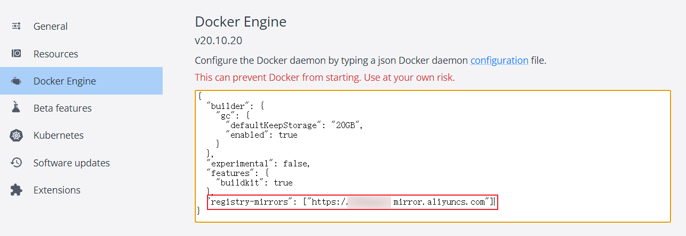
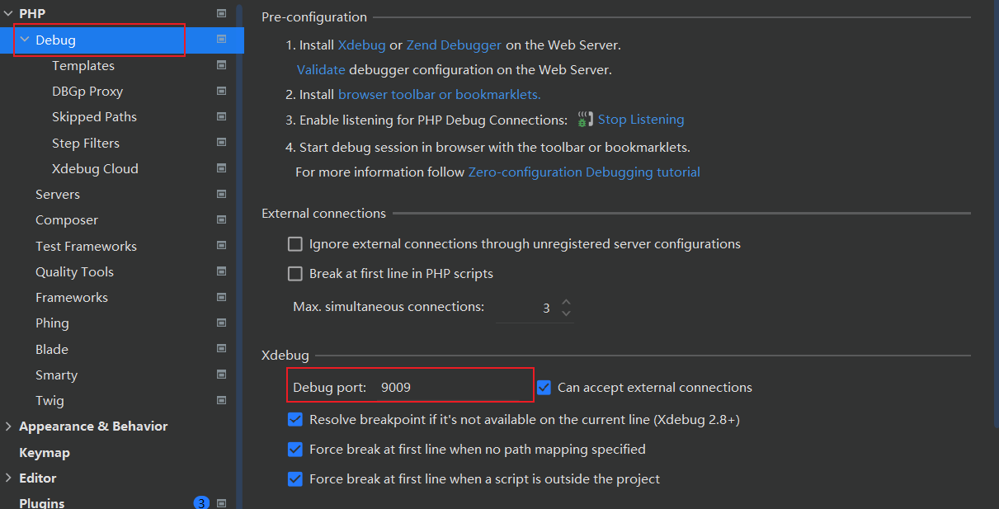
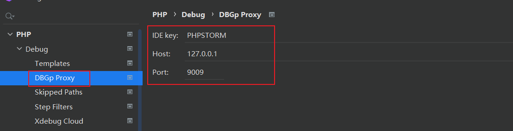
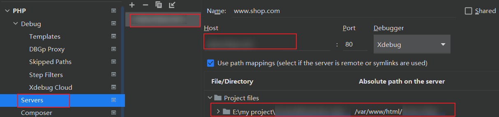
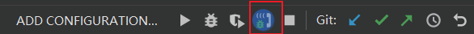
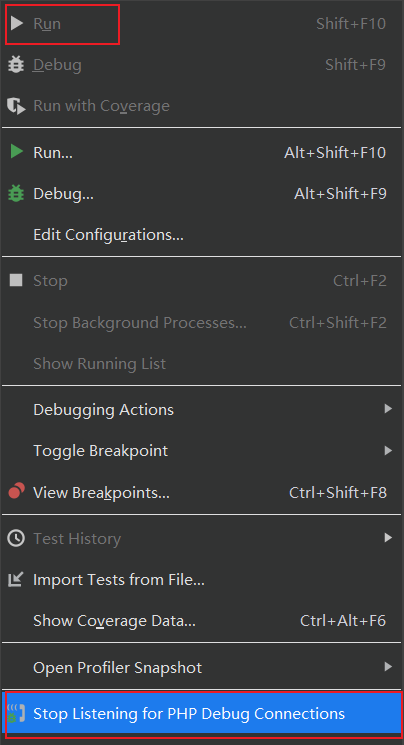
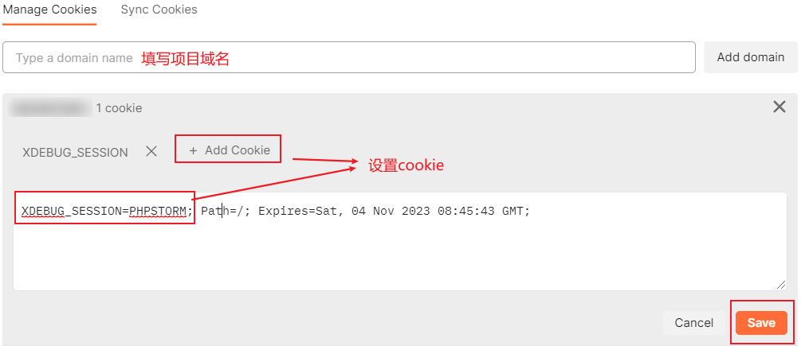
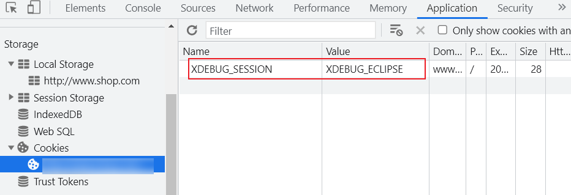

# docker-php-web-space

## 介绍
- 简化 PHPer 搭建环境的 “头大”
- 该项目使用了 Docker Compose 搭建 PHP 所需的环境
- docker-php-web-space 容器包含了 PHP 项目所需的 Nginx、PHP、MySQL、Redis 等服务
- 只需 `docker-compose up -d` 一句命令便可搭建PHP所需的各种环境

## 目录结构
```tex
|-- www                          项目存储目录
|-- mysql                        MySQL服务
|   |-- conf                     msyql配置文件目录
|   |-- data                     mysql数据存储目录
|   `-- my.cnf                   mysql默认配置文件
|-- nginx                        Nginx服务
|   |-- conf                     nginx配置目录
|   |   |-- default.conf         nginx默认配置文件
|   |   `-- demo.conf            项目配置demo（作为参考使用）
|   |-- log                      nginx日志目录
|   `-- nginx.conf               nginx主配置文件
|-- php7.4                       PHP服务
|   |-- conf                     PHP配置目录
|   |   |-- php-fpm.conf         php-fpm进程服务的配置文件
|   |   `-- www.conf             php-fpm进程服务的扩展配置文件
|   `-- php.ini                  php运行核心配置文件
|-- redis                        Redis服务
|    |-- conf                    redis配置目录
|    |-- data                    redis数据存储目录
|    `-- logs                    redis日志目录
|-- .evn.example                 Docker 环境配置示例文件
|-- docker-compose.example.yml   Docker 服务配置示例文件

```


## 安装教程

### Windows docker 环境安装

> 下载地址

- docker 官网：https://www.docker.com/

- 阿里云镜像站：https://developer.aliyun.com/mirror/
  - docker-toolbox: https://mirrors.aliyun.com/docker-toolbox/

> 配置docker镜像加速

- 阿里云镜像加速获取：阿里云容器镜像服务 => 镜像工具 => 镜像加速器
- 配置docker镜像加速：



> 查看docker版本

```sh
docker --version

docker-compose --version
```

### 快速使用

> clone 项目

```shell
# GitHub
git clone https://github.com/ilomoyou/docker-php-web-space.git

# Gitee
git clone https://gitee.com/moon_lsj/docker-php-web-space.git
```

> 创建容器

```shell
cd docker-php-web-space

cp .env.example .env                               # 复制环境变量文件
cp docker-compose.example.yml docker-compose.yml   # 复制 docker-compose 配置文件

# 创建容器
# 拉取PHP扩展因为国内防火墙的缘故可能会失败，可以翻墙或者多重试几次
docker-compose up -d
```

> 查看容器状态

```shell
$ docker-compose ps
    Name                   Command               State                 Ports
------------------------------------------------------------------------------------------
php-web-mysql   docker-entrypoint.sh mysqld      Up      0.0.0.0:3307->3306/tcp, 33060/tcp
php-web-nginx   /docker-entrypoint.sh ngin ...   Up      0.0.0.0:80->80/tcp
php-web-php     docker-php-entrypoint php-fpm    Up      0.0.0.0:9000->9000/tcp
php-web-redis   docker-entrypoint.sh redis ...   Up      0.0.0.0:6379->6379/tcp
```

> 访问测试

- 访问：http://127.0.0.1/ （出现 `hello world!` 字样）
- 访问：http://127.0.0.1/index.php （输出 `phpinfo()` 相关信息）

## 使用说明

> 容器服务版本

- Nginx ***1.24.0***
- PHP ***v7.4***
- MySQL ***v8.0***
- Redis ***v6.2.6***

> Nginx 容器服务说明

- `nginx/nginx.conf` 为 Nginx 的主配置文件
- `nginx/conf/default.conf` 为 Nginx 的默认配置文件
- `nginx/conf` 目录可以存放多个 Nginx 配置文件
- 每个PHP项目可相对应配置一个 `.conf` 文件，可参考 `nginx/conf/demo.conf` 进行改写
- 每次修改配置文件需要重启 nginx 容器，或进入 nginx 容器对 nginx 服务进行重启

```shell
# 重启nginx容器
docker-compose restart php-web-nginx

# 进入nginx容器
docker exec -it php-web-nginx bash
# 检测nginx配置是否正确
nginx -t
# 重新加载nginx配置文件
nginx -s reload
```

> MySQL 容器服务说明

- mysql 宿主机端口映射为 **3306**，登录账号密码为 **root**
- `mysql/my.cnf` 为 mysql 默认配置文件
- `mysql/conf` 为 mysql 自定义配置文件目录
- `mysql/data` 为 mysql 数据存储目录

> Redis 容器服务说明

- redis 宿主机端口映射为 **6379**，登录密码为 **root**
- `redis/data` 为 redis 数据存储目录
- `redis/logs` 为 redis 日志目录
- `redis/conf/redis.conf` 为 redis 配置文件
- `redis.conf` 中默认已支持远程连接，并设置了连接密码为 root，可查找 `requirepass root` 进行修改密码

> PHP 容器服务说明

- php-fpm 宿主机映射端口为 9000

- `php.ini` 中默认已配置 xdebug 远程调试，xdebug 监听端口为 **9009**，ideakey 为 **PHPSTORM**

- `Dockerfile` 中使用了 `docker-php-extension-installer` 安装PHP扩展，详情参考：https://github.com/mlocati/docker-php-extension-installer

- PHP项目在容器内连接 MySQL 和 Redis 可使用容器服务名：`mysql`、`redis` 进行连接，参考如下：

  ```tex
  DB_HOST=mysql
  DB_PORT=3306
  DB_USERNAME=root
  DB_PASSWORD=root
  
  REDIS_HOST=redis
  REDIS_PASSWORD=root
  REDIS_PORT=6379
  ```

> phpstrom 配置 xdebug 详情

1. Debug 配置端口

   

2. DBGp Proxy 配置

   

3. Servers 配置映射路径path mappings

   

4. 开启 Debug 监听模式

   

   或者：

   

5. Postman 设置 Cookie

   在对应域名下添加cookie:  `XDEBUG_SESSION=PHPSTORM;`

   

6. 浏览器可安装 xdebug-helper 插件

   此插件的作用是在cookie中设值：

   


## 项目说明

1.  本项目仅用于学习、练习、参考
2.  本项目只建议在开发环境中使用
3.  切忌在生产环境中使用，避免意料之外的麻烦
4.  本项目处于不断完善中开发中，不承担任何使用后果
5.  开发者有问题或者好的建议可以使用 Issues 反馈交流
